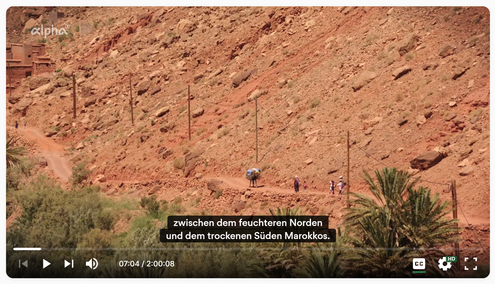
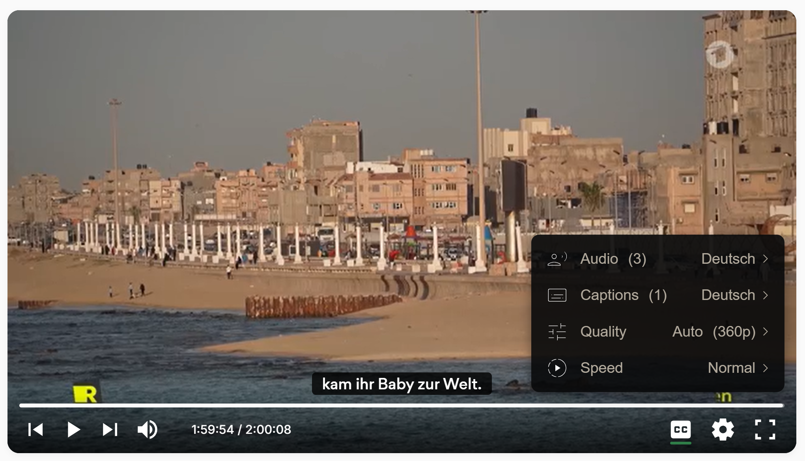

# 📺 TV Streaming App

**Live App Link:** [stream.sprachglanz.com](https://stream.sprachglanz.com)

A responsive web application for streaming public television channels. This project was developed to provide a simple, fast, and user-friendly interface for regional TV channels.

## 📸 Screenshots

## ✨ Features

* **Live Streaming:** Direct integration of HLS streams (HTTP Live Streaming).
* **Custom Video Player:** Custom player controls for volume, quality, and subtitles.
* **Responsive Design:** Desktop and mobile-friendly.
* **Channel Selection:** Clear grid layout for quick navigation between channels.

## 🚀 Local Installation

If you want to run the project locally:

1. Clone the repository: `git clone https://github.com/saicharanpanja/tv-streaming-app.git`
2. Install dependencies: `npm install`
3. Start the development server: `npm start` (or `npm run dev`)