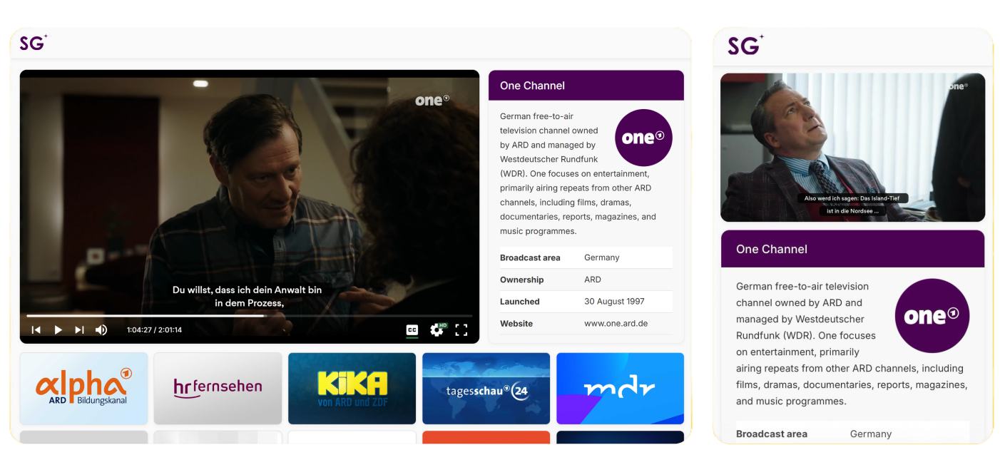

A responsive web application for streaming public TV channels via HLS. The application provides a custom video player, channel selection, subtitles, playback controls and detailed channel information.

[Checkout the demo](https://stream.sprachglanz.com)

## Features

- 📡 **Live streaming** - playback of TV channels using HLS
- 🎬 **Clean video player** - customized for a better user experience
- ⌨️ **Shortcuts** - supports keyboard shortcuts
- ⚙️ **Playback controls** - adjust volume, speed, quality on the fly
- 📖 **Multiple captions** - support for multiple caption tracks
- 🔎 **Fullscreen** - supports native fullscreen
- 📱 **Responsive** - works with any screen size
- 🎨 **Dynamic theming** - UI colors adapt dynamically to each TV channel
- 📺 **Channel selection** - grid-based navigation between available TV channels
- ℹ️ **Channel information** - detailed information about the currently selected channel
- 🧩 **Single-Page Application** – seamless navigation without page reloads

## Technologies

* **React** - user interface and component-based application structure
* **JavaScript** - logic and interactions
* **HTML5** - video playback and semantic structure
* **CSS3** - styling and responsive layout
* **HLS** - http live streaming
* **Vite** - development environment and build tooling
* **Git & GitHub** - version control and project management

## Quick setup

Before proceeding make sure you have Node.js and npm installed.

1. Clone the repository: `git clone https://github.com/saicharanpanja/tv-streaming-app.git`
2. Install dependencies: `npm install`
3. Start the development server: `npm run dev`

## Shortcuts

| Key             | Action                                       |
| --------------- | -------------------------------------------- |
| `space` , `k`   | Toggle playback                              |
| `c`             | Toggle captions                              |
| `f`             | Toggle fullscreen                            |
| `m`             | Toggle mute                                  |
| &uarr;          | Increase volume by 10%                       |
| &darr;          | Decrease volume by 10%                       |
| &larr; , `j`    | Seek backward 10 seconds                     |
| &rarr; , `l`    | Seek forward 10 seconds                      |
| `Home`/`End`    | Seek to beginning/last seconds               |
| `0` to `9`      | Seek to 0% to 90%                            |
| `Shift + N`     | Move to the next channel                     |
| `Shift + P`     | Move to the previous channel                 |

## About the Project

This project is a React-based TV streaming application focused on HLS video playback, interactive player controls and responsive channel navigation. The main goal was to build a clean and intuitive streaming interface while exploring HLS integration and interactive web development.